<!-- Table of Contents -->
- [はじめに](#はじめに)
- [開発・実行環境準備](#開発実行環境準備)
    - [VisualStudio プラグイン](#VisualStudio-プラグイン)
    - [プロジェクト作成](#プロジェクト作成)
- [開発とデプロイ](#開発とデプロイ)
    - [コード記述](#コード記述)
    - [デプロイ設定](#デプロイ設定)
        - [認証情報の準備](#認証情報の準備)
        - [デプロイ](#デプロイ)
- [テスト](#テスト)
    - [Visual Studio でテスト](#Visual-Studio-でテスト)
    - [AWS Console でテスト](#AWS-Console-でテスト)

<!-- Table of Contents -->
# はじめに

このドキュメントは AWS RDS で作成した Serverless RDB に  
Data API を使用してアクセスするための環境構築と確認手順です。  
この手順書では `PostgreSQL` 互換を使って環境構築します。

# 今回の環境
VPC(Virtual Private Cloud)の中に、検証対象となる RDB と作業用のEC2 を用意します。クライアントPCからはEC2を経由してRDSにアクセスするようにします。

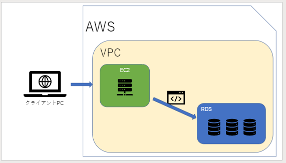

# VPCとセキュリティグループ作成
VPC コンソールでVPC を作成します。また EC2 用と RDB 用のセキュリティグループも作成します。
## VPCの設定とタグ
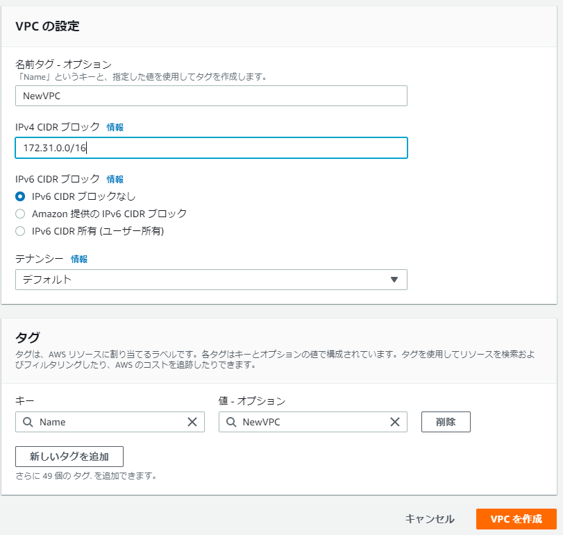
- 名前タグ
  - 「任意の文字列」 
- IPv4 CIDR ブロック
  - 「任意の範囲 (例：172.31.0.0/16)」 
- IPv6 CIDR ブロック
  - 「IPv6 CIDR ブロックなし」
- テナンシー
  - 「デフォルト」
- タグ
  - 設定は任意

## セキュリティグループの作成
VPCコンソールメニューの「セキュリティグループ」からセキュリティグループを作成します。
### 作業EC2用セキュリティグループ作成
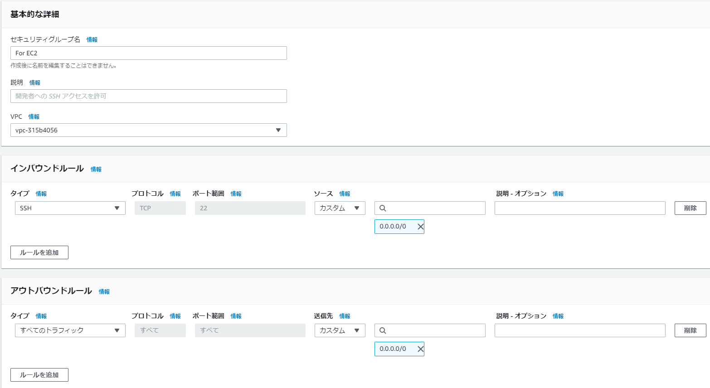
- 基本的な詳細
  - セキュリティグループ名
    - 「EC2 用とわかる文字列」
  - 説明
    - 「任意の文字列」
  - VPC
    - 「前項で作成したＶＰＣ」
- インバウンドルール
  - タイプ
    - 「SSH」
  - ソース
    - 「カスタム (0.0.0.0)」
- アウトバウンドルール
  - 変更なし

### RDB用セキュリティグループ作成
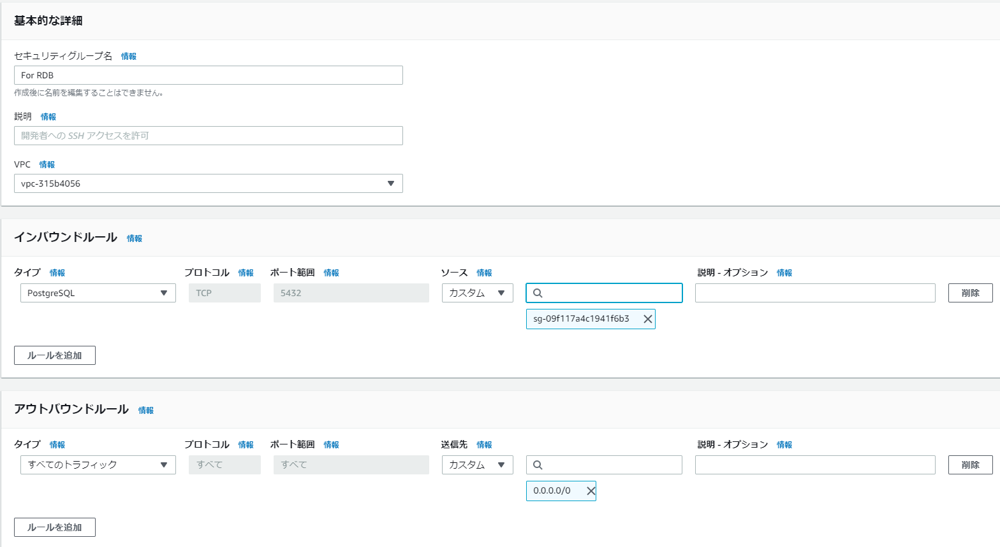
- 基本的な詳細
  - セキュリティグループ名
    - 「RDB 用とわかる文字列」
  - 説明
    - 「任意の文字列」
  - VPC
    - 「前項で作成したＶＰＣ」
- インバウンドルール
  - タイプ
    - 「PostgresSQL」
  - ソース
    - 「カスタム (EC2用のセキュリティグループを選択)」
- アウトバウンドルール
  - 変更なし  
# EC2作成
RDBを操作する作業用のEC2を、EC2 コンソールで作成します。
## ステップ1:Amazon マシンイメージ (AMI)
`Amazon Linux 2 AMI (HVM), SSD Volume Type` を選択し「次のステップ」ボタンをクリックします。
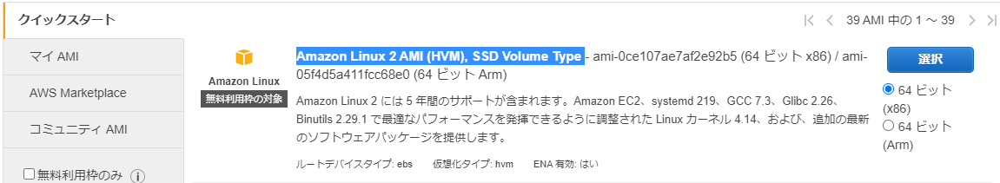
## ステップ2:インスタンスタイプの選択
無料利用枠の対象である `t2.micro`  を選択し「次のステップ」ボタンをクリックします。
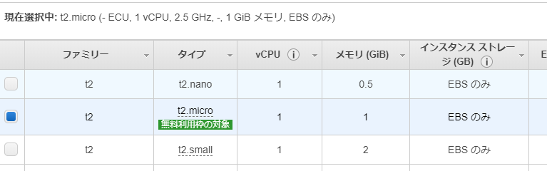
## ステップ3:インスタンスの詳細の設定
デフォルトのまま「次のステップ」ボタンをクリックします。
## ステップ4:ストレージの追加
デフォルトのまま「次のステップ」ボタンをクリックします。
## ステップ5:タグの追加
デフォルトのまま「次のステップ」ボタンをクリックします。
## ステップ6:セキュリティグループの設定
下記を設定し、「次のステップ」ボタンをクリックします。
- セキュリティグループの割り当て
  - 「既存のセキュリティグループを選択する」
- セキュリティグループＩＤ
  - 「[作業EC2用セキュリティグループ作成](#作業EC2用セキュリティグループ作成)で作成したセキュリティグループ」
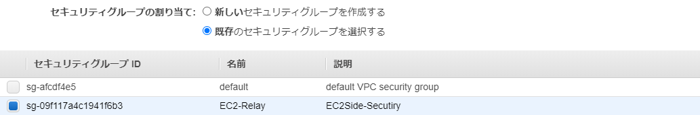
## ステップ7:インスタンス作成の確認
設定内容を確認したうえで、「起動」ボタンをクリックする。 
### 既存のキーペアを選択するか、新しいキーペアを作成します。
`新しいキーペアの作成`を選択し、キーペア名に任意の文字列を入力します。「キーペアのダウンロード」ボタンが有効になったらクリックし、`*.pem` ファイルをダウンロードしておきます。

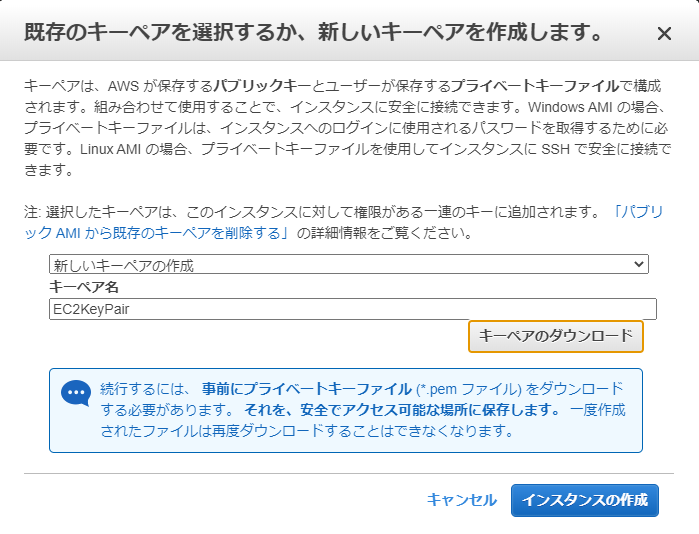
  
# RDB作成
## Aurora Serverlessの作成
[Amazon Aurora ユーザガイド](https://docs.aws.amazon.com/ja_jp/AmazonRDS/latest/AuroraUserGuide/CHAP_AuroraOverview.html)の、[Amazon Aurora Serverless を使用する](https://docs.aws.amazon.com/ja_jp/AmazonRDS/latest/AuroraUserGuide/aurora-serverless.html)を参考に `Amazon Aurora Serverless DBクラスター` を、RDSコンソールで作成します。

### データベースの作成とエンジンのオプション
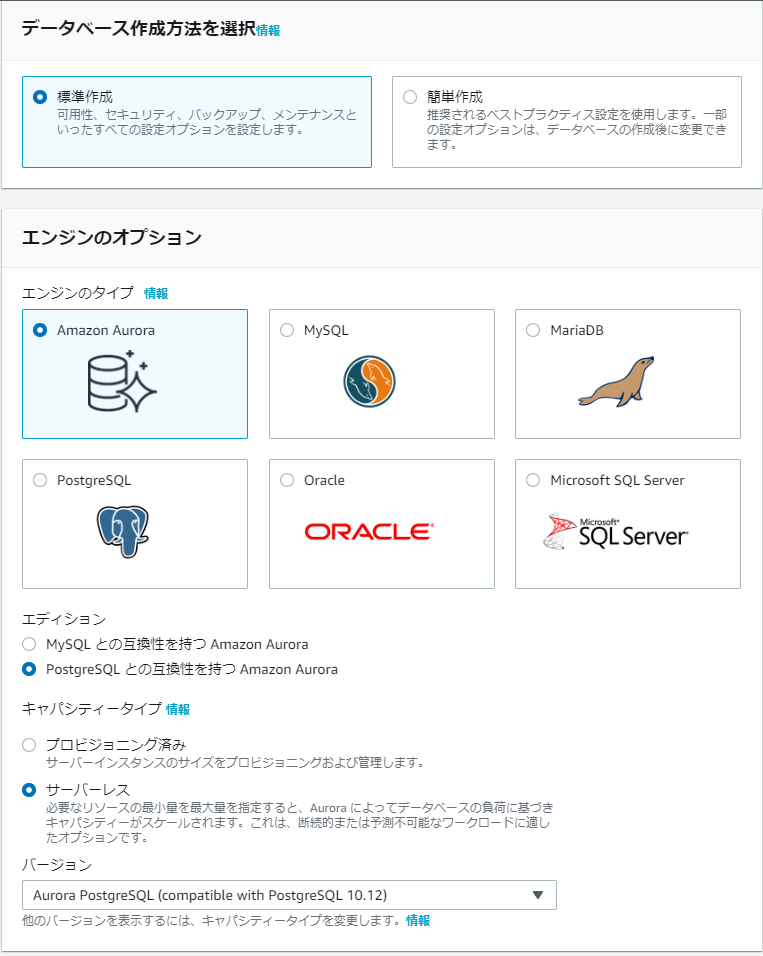
- データベースの作成方法
  - 「標準作成」 
- エンジンのオプション   
  - エンジンのタイプ
    - 「Amazon Aurora」
  - エディション
    - 「PostgreSQL との互換性を持つ Amazon Aurora」
  - キャパシティータイプ
    - `「サーバーレス」` 
  - バージョン
    - 「Aurora PostgreSQL (Compatible with PostgreSQL 10.12)」 

### 設定とキャパシティの設定
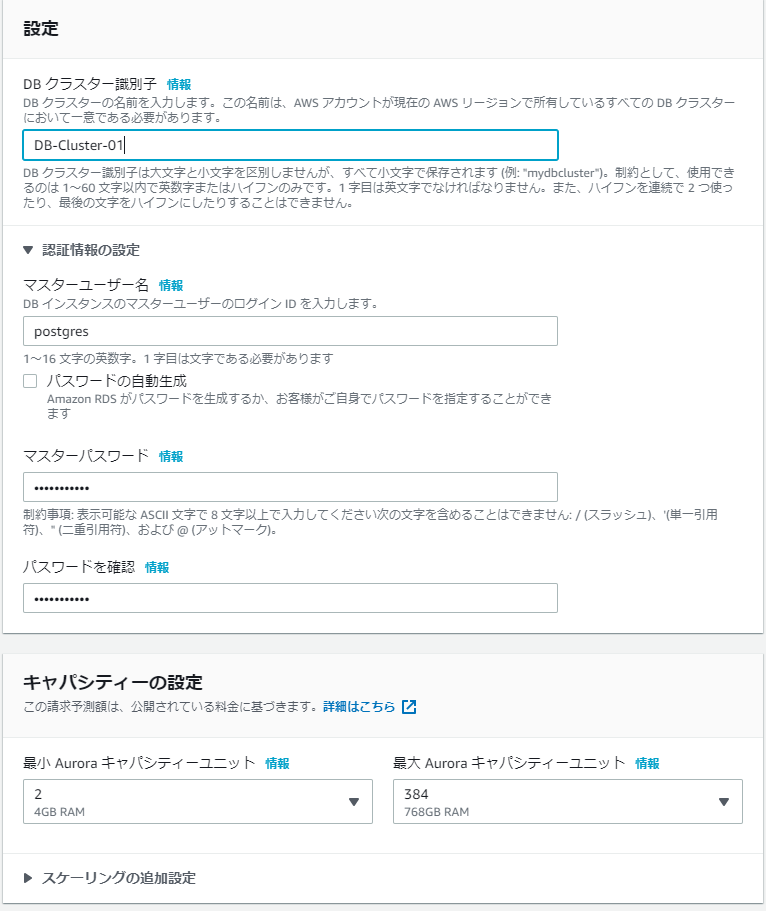
- DB クラスター識別子
  - 「任意の文字列」
- 認証情報の設定
  - マスターユーザー名
    - 「任意の文字列」
  - マスターパスワード
    -  「自動生成」 or 「任意の文字列」
- キャパシティの設定
  - 最小 Aurora キャパシティーユニット
    - 「2 (4GB RAM)」
  - 最大 Aurora キャパシティーユニット
    - 「4 (4GB RAM)」

### 接続
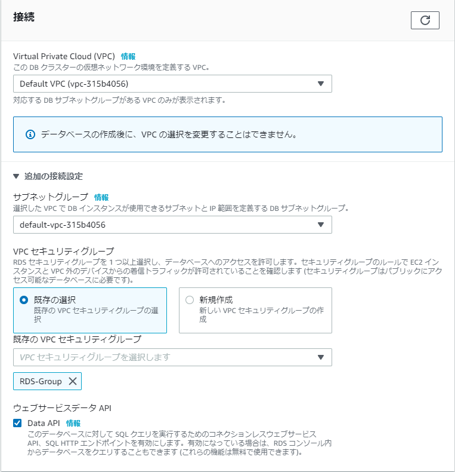
#### Virtual Private Cloud(VPC)
「[VPCとセキュリティグループ作成](#VPCとセキュリティグループ作成)で作成したＶＰＣ」
#### 追加の接続設定
##### サブネットグループ
「デフォルト」(そのまま)
##### VPC セキュリティグループ
「既存の選択」を選択し 
「[RDB用セキュリティグループ作成](#RDB用セキュリティグループ作成)で作成したセキュリティグループ」を選択後、`default` を削除する。(図を参照)
##### Data API
必ず`チェック`を入れる

# 最後に
CLI で作業できるようになりたい。